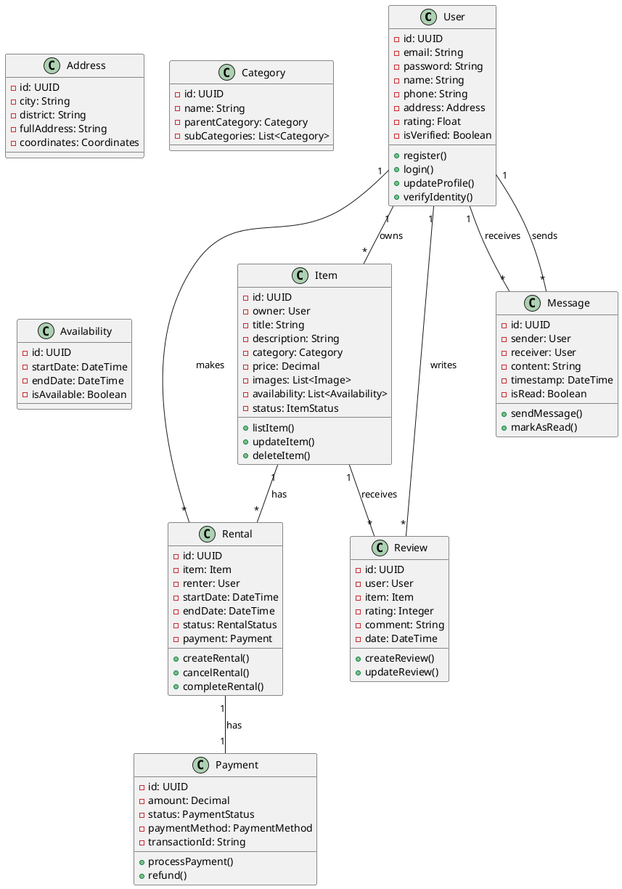
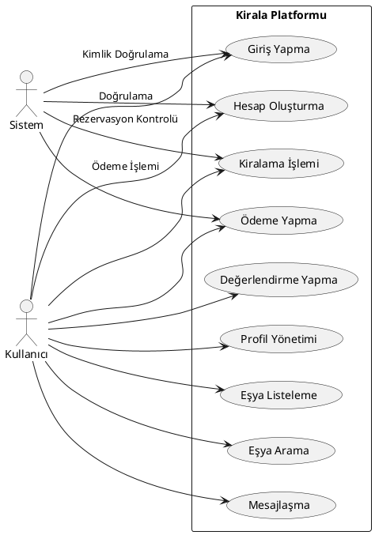
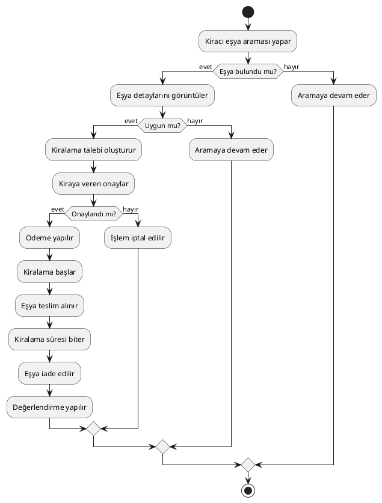
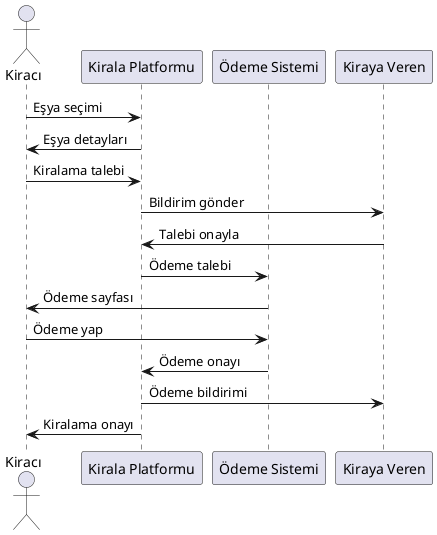
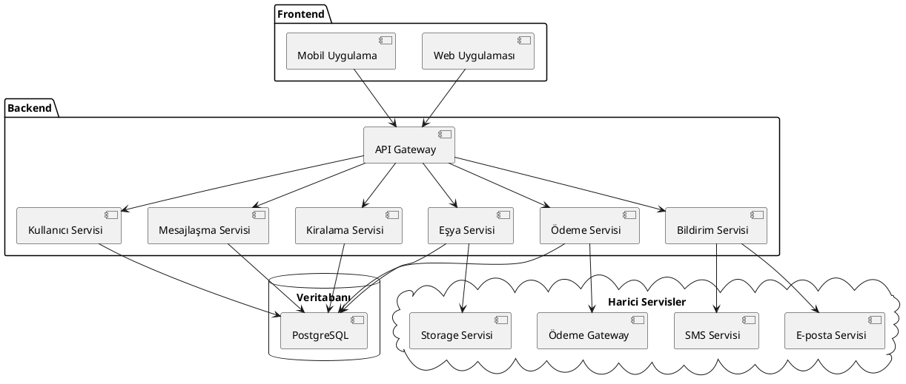

# Kirala - UML Diyagramları Dokümanı

## 1. Sınıf Diyagramı (Class Diagram)

### Temel Sınıflar ve İlişkileri

## 2. Use Case Diyagramı

## 3. Aktivite Diyagramı (Kiralama Süreci)

## 4. Sekans Diyagramı (Kiralama İşlemi)

## 5. Bileşen Diyagramı

## Notlar ve Açıklamalar

1. **Sınıf Diyagramı**:
   - Temel iş mantığını ve veri yapısını gösterir
   - Sınıflar arası ilişkileri ve özellikleri içerir
   - Her sınıfın temel metodları belirtilmiştir

2. **Use Case Diyagramı**:
   - Sistemin temel kullanım senaryolarını gösterir
   - Kullanıcı etkileşimlerini ve sistem davranışlarını içerir

3. **Aktivite Diyagramı**:
   - Kiralama sürecinin adım adım akışını gösterir
   - Karar noktaları ve alternatif akışlar belirtilmiştir

4. **Sekans Diyagramı**:
   - Kiralama işleminin sistemler arası etkileşimini gösterir
   - Zaman akışı ve mesajlaşma sırası belirtilmiştir

5. **Bileşen Diyagramı**:
   - Sistemin mimari yapısını gösterir
   - Servisler arası bağımlılıkları ve iletişimi içerir

## Kullanım İpuçları

1. Bu diyagramları çizerken PlantUML veya benzeri bir UML araç kullanabilirsiniz
2. Diyagramları projenin gelişimine göre güncel tutun
3. Her diyagramı ayrı bir dosyada saklayabilirsiniz
4. Diyagramları dokümantasyonunuzla birlikte versiyonlayın 